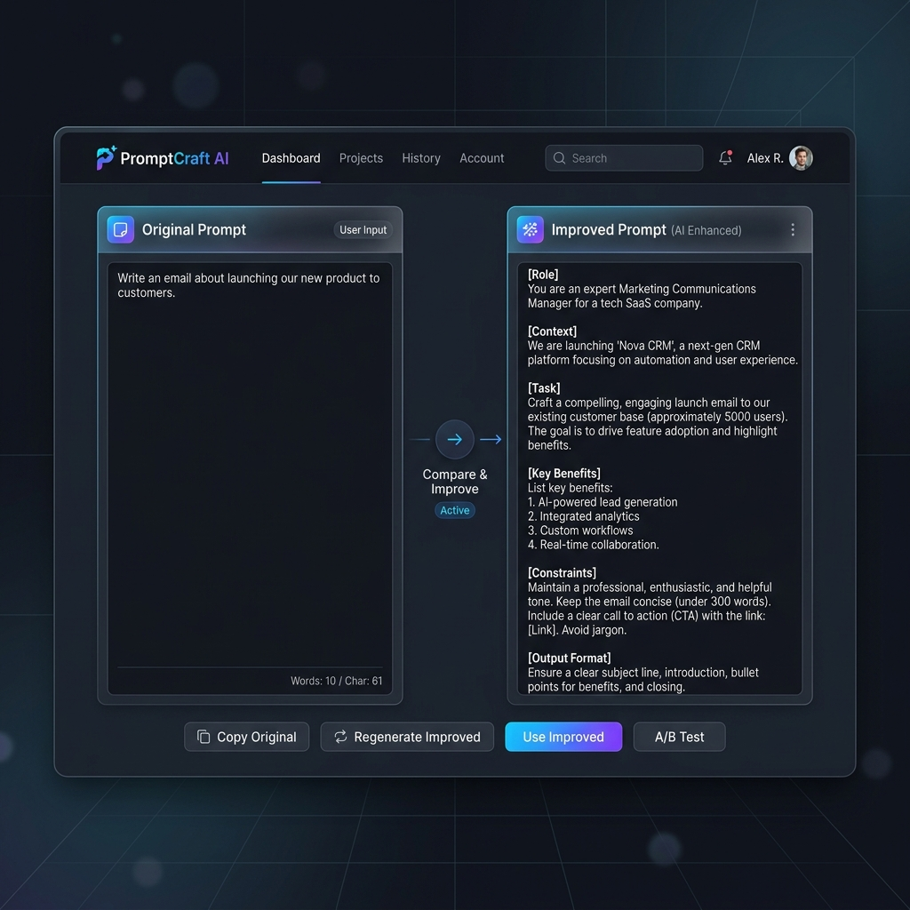
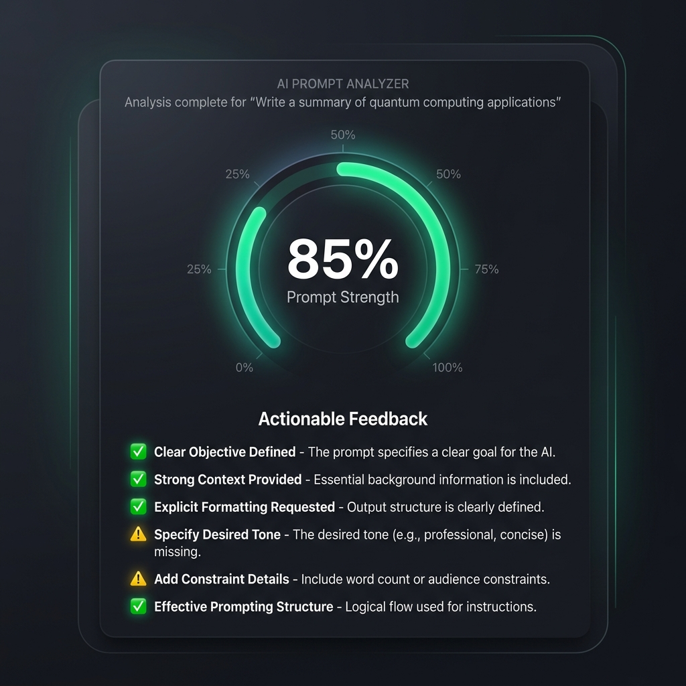

# PromptCraft AI 🚀
### Smart Prompt Builder & Optimizer

**PromptCraft AI** is a full-stack web application designed to bridge the gap between basic ideas and high-quality AI outputs. By leveraging professional prompt engineering frameworks (Role-Task-Constraint-Format), it transforms simple user inputs into structured, actionable, and professional prompts.



---

## ✨ Features

- **🧠 Smart Prompt Improver:** Automatically restructures raw text into a professional `Role + Task + Constraints + Format` framework.
- **🔍 Real-time Analysis:** Uses AI to identify missing clarity, context, or quality boundaries, providing a "Quality Score" and suggestions.
- **📚 Template Library:** Instant access to curated prompt templates for Coding, Business, Creative Writing, and Resume building.
- **🔄 Side-by-Side Comparison:** Compare "Before" vs "After" prompts to see exactly how your input was refined.
- **📜 History Management:** Keep track of your last 10 refined prompts (stored locally via `localStorage`).

---

## 📸 Screenshots

### AI Prompt Analysis


---

## 🛠️ Tech Stack

- **Frontend:** React, Vanilla CSS (Modern glassmorphism & dark mode UI)
- **Backend:** Node.js, Express
- **AI Integration:** Hosted LLM via OpenRouter API
- **State Management:** React Hooks & LocalStorage

---

## 🚀 Getting Started

### Prerequisites
- Node.js (v16+)
- NPM or Yarn

### Installation

1. **Clone the repository:**
   ```bash
   git clone https://github.com/Srinidhi262005/promptcraft-ai.git
   ```

2. **Install Dependencies:**
   ```bash
   # Root
   npm install

   # Server
   npm install --prefix server

   # Client
   npm install --prefix client
   ```

3. **Environment Setup:**
   Create a `.env` file in the `server` directory using `.env.example`:
   ```env
   OPENROUTER_API_KEY=your_key_here
   PORT=5000
   ```

4. **Run Locally:**
   ```bash
   npm run dev
   ```
   Access the app at `http://localhost:3000`

---

## 🤝 Contributing

Contributions are welcome! Feel free to open an issue or submit a pull request for improvements.

## 📄 License

This project is licensed under the MIT License.

---

*Built with ❤️ for Prompt Engineers.*
